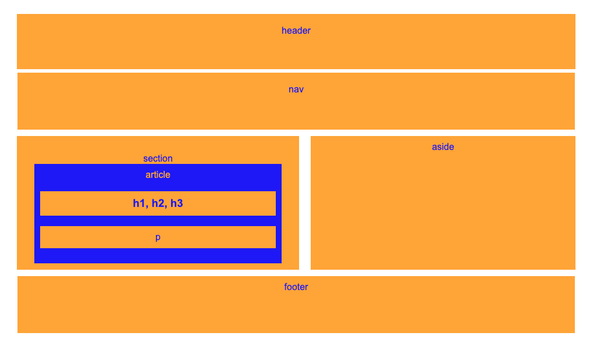

# HW-Wireframe

### What is this?
The practice of the ancient art of HTML:5 and CSS (okay not so ancient, I embelish things :) ).

### Who is it for?
Anyone looking to learn to build out a wireframe with just HTML:5 and CSS, this is a good practice problem. Build a wirefram from scratch! Take a look at mine for inspiration! 

### How do I use this myself?
You can use this yourself by first copying the code and using git clone in your terminal or your command prompt and then to see the finished product you can go ahead and open this code in Visual Studio code and right click on the index.html to open this in browser. Take a look at the wireframe there and take a look at the code. The real challenge is when you close out of my code and try to recreate it yourself from scratch! You can do this!

# Here is a picture of the wireframe if you just want to take a gander at the picture and not look at the code down on your machine. You can also take a look at this code without using git clone by clicking through the files in this repo. Enjoy!

